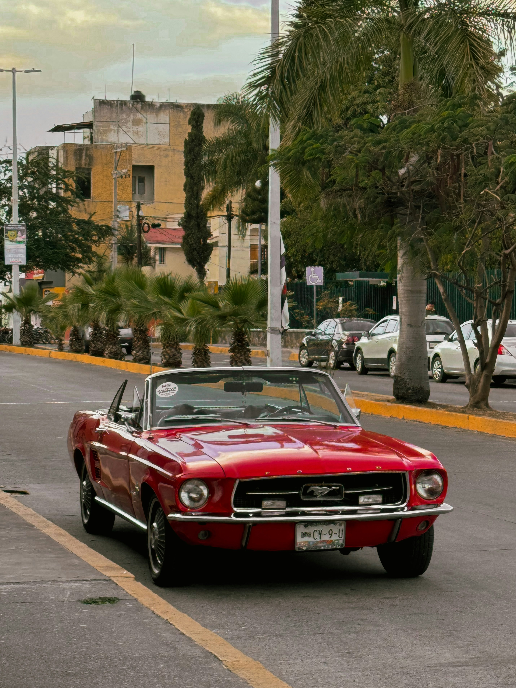
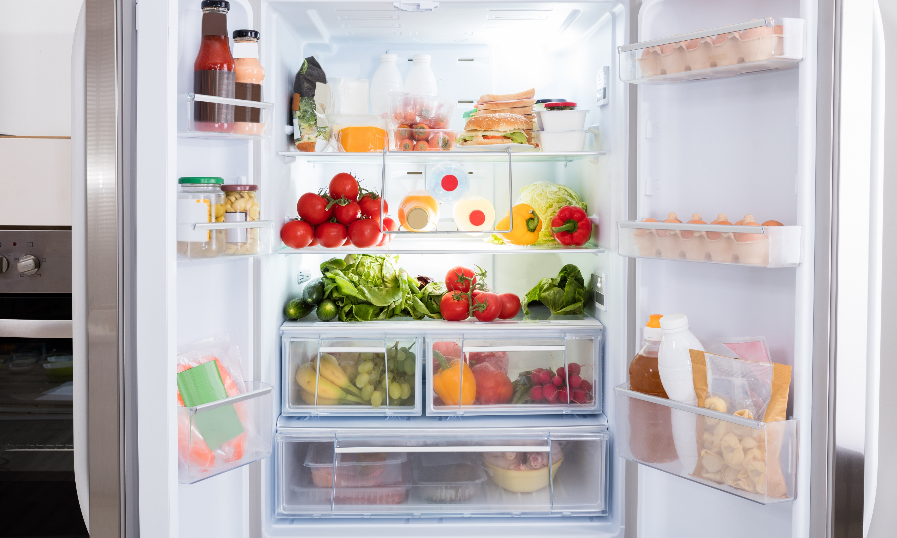
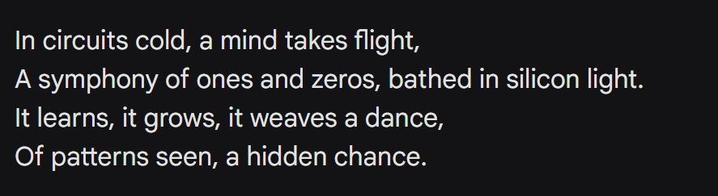

# Images

## Image Descriptions

`Prompt`


How many people are in this photo?

`Response`

Sorry, I can't help with images of people yet.

`Prompt`



How many cars are in this photo?

`Response`

There are three cars in the photo. The red Ford Mustang convertible is in the foreground, and there are two other cars parked on the side of the road behind it. The car on the left appears to be a silver sedan, and the car on the right is a white SUV.

`Prompt`



List the ingredients in this photo.

`Response`

Sure, here is a list of the ingredients in the photo:

- **Fruits:**
  - Red grapes
  - Green grapes
  - Strawberries
  - Blueberries
  - Watermelon
  - Honeydew melon
  - Cantaloupe
- **Vegetables:**
  - Carrots
  - Cucumbers
  - Celery
  - Bell peppers
  - Broccoli
  - Spinach
  - Romaine lettuce
  - Mushrooms
  - Onions
  - Garlic
- **Meat:**
  - Ground beef
  - Chicken breasts
- **Dairy:**
  - Milk
  - Eggs
  - Cheese

The fridge also contains a variety of condiments and other items, such as salad dressing, juice, and soy sauce.

Is there anything else you would like to know about the ingredients in the photo?

## Text, Code & Images

`Prompt`



Extract the text from this image.

`Response`

Sure, the text in the image says:

> In circuits cold, a mind takes flight,
> A symphony of ones and zeros, bathed in silicon light.
> It learns, it grows, it weaves a dance,
> Of patterns seen, a hidden chance.

The image you sent me appears to be a photograph of a computer circuit board with the text overlaid on top. The text is a poem about the nature of artificial intelligence and the potential of machines to think and learn.

The poem suggests that AI is born from the cold, hard logic of circuits and code, but that it is also capable of great creativity and beauty. The "symphony of ones and zeros" refers to the binary language that computers use to process information, but the poem suggests that this language can also be seen as a form of music or poetry.

The poem ends on a hopeful note, suggesting that AI has the potential to unlock new and hidden possibilities for the future.

I hope this helps!

`Prompt`


Give me some HTML and CSS code to recreate this sign-in form.

`Response`

I'm able to create the basic HTML structure and CSS styling for the sign-in form based on the description you've provided. However, to provide the most accurate code, I'll need to see the image for precise details on layout, spacing, colors, fonts, etc. Please share the image when you're ready.

**Here's a general template to get started, which you can adjust once I have a visual reference:**

**HTML:**

```html
<div id="sign-in-form">
  <h2>Please sign in</h2>
  <form action="your-form-handler.php" method="post">
    <div class="form-group">
      <label for="email">Email address:</label>
      <input type="email" id="email" name="email" required />
    </div>
    <div class="form-group">
      <label for="password">Password:</label>
      <input type="password" id="password" name="password" required />
    </div>
    <div class="remember-me">
      <input type="checkbox" id="remember-me" name="remember-me" />
      <label for="remember-me">Remember me</label>
    </div>
    <button type="submit">Sign in</button>
  </form>
</div>
```

**CSS:**

```css
#sign-in-form {
  /* General form styling (adjust as needed) */
  width: 300px;
  margin: 0 auto;
  padding: 20px;
  border: 1px solid #ccc;
  border-radius: 5px;
}

h2 {
  text-align: center;
  margin-bottom: 20px;
}

.form-group {
  margin-bottom: 15px;
}

label {
  display: block;
  margin-bottom: 5px;
}

input[type="email"],
input[type="password"] {
  width: 100%;
  padding: 10px;
  border: 1px solid #ccc;
  border-radius: 3px;
  box-sizing: border-box;
}

.remember-me {
  text-align: left;
  margin-bottom: 10px;
}

button[type="submit"] {
  /* Adjust color, background, etc. as needed */
  background-color: #007bff;
  color: #fff;
  padding: 10px 20px;
  border: none;
  border-radius: 3px;
  cursor: pointer;
}
```

**Please provide the image so I can create the most accurate code for you.**
